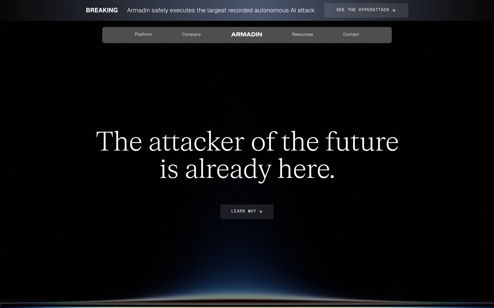

# armadin DESIGN.md

> Auto-generated design system — reverse-engineered via static analysis by skillui.
> Frameworks: None detected
> Colors: 14 · Fonts: 3 · Components: 0
> Icon library: not detected · State: not detected
> Primary theme: dark · Dark mode toggle: no · Motion: none

## Visual Reference

**Match this design exactly** — study colors, fonts, spacing, and component shapes before writing any UI code.



---

## 1. Visual Theme & Atmosphere

This is a **dark-themed** interface with a flat, cool visual language. Elevation is achieved through color and border shifts rather than shadows — a clean, industrial aesthetic. Typography pairs **Geist** for display/headings with **FK Roman Standard** for body text, creating clear visual hierarchy through type contrast. Spacing follows a **5px base grid** (standard density), with scale: 5, 10, 15, 20, 25, 30, 35, 40px. The palette is predominantly monochromatic with **#0051c3** as the single accent color — used sparingly for interactive elements and emphasis.

---

## 2. Color Palette & Roles

| Token | Hex | Role | Use |
|---|---|---|---|
| background | `#0c0c0c` | background | Page background, darkest surface |
| surface | `#000000` | surface | Card and panel backgrounds |
| text-primary | `#ffffff` | text-primary | Headings and body text |
| text-muted | `#404040` | text-muted | Captions, placeholders, secondary info |
| border | `#595959` | border | Dividers, card borders, outlines |
| accent | `#0051c3` | accent | CTAs, links, focus rings, active states |
| danger | `#de5052` | danger | Error states, destructive actions |
| info | `#0000ee` | info | Informational highlights |
| unknown | `#f8f8f3` | unknown | Palette color |
| unknown | `#9f9f9f` | unknown | Palette color |
| unknown | `#8d8d8d` | unknown | Palette color |
| unknown | `#ebebeb` | unknown | Palette color |
| unknown | `#521010` | unknown | Palette color |
| unknown | `#181818` | unknown | Palette color |

### CSS Variable Tokens

```css
--_hyperattack-campaign---colors--accent: #ff0404;
--_hyperattack-campaign---fonts--primary: Geist,Arial,sans-serif;
--_hyperattack-campaign---fonts--secondary: "FK Roman Standard",Arial,sans-serif;
--_hyperattack-campaign---brand--primary-hues--red-5: #bd0c06;
--_hyperattack-campaign---brand--primary-hues--blue-1: #93c5fd;
--_hyperattack-campaign---brand--primary-hues--blue-2: #82ceff;
--_hyperattack-campaign---brand--primary-hues--blue-3: #3b82f6;
--_hyperattack-campaign---brand--primary-hues--blue-4: #0284c7;
--_hyperattack-campaign---brand--primary-hues--cyan-1: #06b6d4;
--_hyperattack-campaign---brand--primary-hues--indigo-1: #7c9aeb;
--_hyperattack-campaign---brand--primary-hues--violet-1: #a56aff;
--_hyperattack-campaign---brand--primary-hues--magenta-1: #ff5fd1;
--_hyperattack-campaign---brand--primary-hues--yellow-1: #fde68a;
--_hyperattack-campaign---brand--primary-hues--yellow-2: #fbbf24;
--_hyperattack-campaign---brand--primary-hues--yellow-3: #f59e0b;
--_hyperattack-campaign---brand--primary-hues--red-1: #fca5a5;
--_hyperattack-campaign---brand--primary-hues--red-2: #f87171;
--_hyperattack-campaign---brand--primary-hues--red-3: #ef4444;
--_hyperattack-campaign---brand--primary-hues--red-4: red;
--_hyperattack-campaign---brand--secondary-hues--slate-1: #94a3b8;
```


---

## 3. Typography Rules

**Font Stack:**
- **FK Roman Standard** — Heading 1, Heading 2
- **Geist** — Body, Caption
- **Geist Mono** — Code

**Font Sources:**

```css
@font-face {
  font-family: "Geist";
  src: url("fonts/Geist-Bold.ttf") format("truetype");
  font-weight: 700;
}
@font-face {
  font-family: "Geist";
  src: url("fonts/Geist-Regular.ttf") format("truetype");
  font-weight: 400;
}
@font-face {
  font-family: "Geist Mono";
  src: url("fonts/GeistMono-Bold.ttf") format("truetype");
  font-weight: 700;
}
@font-face {
  font-family: "Geist Mono";
  src: url("fonts/GeistMono-Regular.ttf") format("truetype");
  font-weight: 400;
}
```

| Role | Font | Size | Weight |
|---|---|---|---|
| Heading 1 | FK Roman Standard | 76.5072px | 700 |
| Heading 2 | FK Roman Standard | 60px | 700 |
| Body | Geist | 16px | 400 |
| Caption | Geist | 14.4px | 400 |
| Code | Geist Mono | 14px | 400 |

**Typographic Rules:**
- Limit to 3 font families max per screen
- Use **FK Roman Standard** for body/UI text, **Geist** for display/headings
- Maintain consistent hierarchy: no more than 3-4 font sizes per screen
- Headings use bold (600-700), body uses regular (400)
- Line height: 1.5 for body text, 1.2 for headings
- Use color and opacity for secondary hierarchy, not additional font sizes


---

## 4. Component Stylings

No components detected. Scan `src/components/` or `components/` to populate this section.

---

## 5. Layout Principles

- **Base spacing unit:** 5px
- **Spacing scale:** 5, 10, 15, 20, 25, 30, 35, 40, 60, 80, 90, 95
- **Border radius:** 2px, 4px, 5px 5px 0px 0px, 5.76px, 6px, 8px, 14px

**Spacing as Meaning:**
| Spacing | Use |
|---|---|
| 2.5-5px | Tight: related items within a group |
| 10px | Medium: between groups |
| 15-20px | Wide: between sections |
| 30px+ | Vast: major section breaks |


---

## 6. Depth & Elevation

No box-shadow values detected. The design uses a **flat visual style** — elevation is conveyed through background color shifts and borders rather than shadows.

**Elevation Strategy:**
| Level | Technique | Use |
|---|---|---|
| 0 — Base | Background color | Page background |
| 1 — Raised | Lighter surface + subtle border | Cards, panels |
| 2 — Floating | Even lighter surface + stronger border | Dropdowns, popovers |
| 3 — Overlay | Backdrop + modal surface | Modals, dialogs |


---

## 8. Do's and Don'ts

### Do's

- Use `#0051c3` for interactive elements (buttons, links, focus rings)
- Use `#0c0c0c` as the primary page background
- Pair **FK Roman Standard** (body) with **Geist** (display) — these are the only allowed fonts
- Follow the **5px** spacing grid for all margins, padding, and gaps
- Use border and background shifts for elevation — not shadows
- Use border-radius from the scale: 2px, 4px, 5px 5px 0px 0px, 5.76px, 6px

### Don'ts

- Don't introduce colors outside this palette — extend the design tokens first
- Don't introduce additional font families beyond FK Roman Standard and Geist and Geist Mono
- Don't use arbitrary spacing values — stick to multiples of 5px
- Don't add box-shadow — this design system uses flat elevation
- Don't use gradients — the design uses solid colors only
- Don't use arbitrary border-radius values — pick from the defined scale
- Don't use backdrop-blur or blur effects

### Anti-Patterns (detected from codebase)

- No box-shadow on any element
- No gradient backgrounds
- No blur or backdrop-blur effects
- No zebra striping on tables/lists


---

## 9. Responsive Behavior

No breakpoints detected. Consider adding responsive breakpoints to the design system.

---

## 10. Agent Prompt Guide

Use these as starting points when building new UI:

### Build a Card

```
Background: #000000
Border: 1px solid #595959
Radius: 5.76px
Padding: 20px
Font: FK Roman Standard
No shadows — use borders and surface colors for depth.
```

### Build a Button

```
Primary: bg #0051c3, text white
Ghost: bg transparent, border #595959
Padding: 10px 20px
Radius: 5.76px
Hover: opacity 0.9 or lighter shade
Focus: ring with #0051c3
```

### Build a Page Layout

```
Background: #0c0c0c
Max-width: 1280px, centered
Grid: 5px base
Responsive: mobile-first, breakpoints from Section 9
```

### Build a Stats Card

```
Surface: #000000
Label: #404040 (muted, 12px, uppercase)
Value: #ffffff (primary, 24-32px, bold)
Status: use success/warning/danger from Section 2
```

### Build a Form

```
Input bg: #0c0c0c
Input border: 1px solid #595959
Focus: border-color #0051c3
Label: #404040 12px
Spacing: 20px between fields
Radius: 5.76px
```

### General Component

```
1. Read DESIGN.md Sections 2-6 for tokens
2. Colors: only from palette
3. Font: FK Roman Standard, type scale from Section 3
4. Spacing: 5px grid
5. Components: match patterns from Section 4
6. Elevation: flat, surface shifts
```
